# 编译小组作业+ANTLR

[TOC]

## ANTLR的安装和测试

官方说明：[antlr4/doc/getting-started.md](https://github.com/antlr/antlr4/blob/d25d421780286e3de0714831a5f82eca59234249/doc/getting-started.md)

### 安装

新版ANTLR的安装可以通过pip进行。

1. 执行`pip install antlr4-tools`（如有网络问题，请按照 [pypi | 镜像站使用帮助 | 清华大学开源软件镜像站 | Tsinghua Open Source Mirror](https://mirrors.tuna.tsinghua.edu.cn/help/pypi/) 配置清华源）；
2. 执行`antlr4`或者`antlr4-parse`来自动下载Java包和ANTLR的JAR包（提示 `ANTLR tool needs Java to run; install Java JRE 11 yes/no (default yes)?` 时回车即可）。

### 测试

创建`Expr.g4`文件（文件名 应该和 文件内容的grammer后的名字 保持一致），内容使用官方提供的例子：

``` g4
grammar Expr;		
prog:	expr EOF ;
expr:	expr ('*'|'/') expr
    |	expr ('+'|'-') expr
    |	INT
    |	'(' expr ')'
    ;
NEWLINE : [\r\n]+ -> skip;
INT     : [0-9]+ ;
```

使用`antlr4-parse`命令进行测试：

- 执行命令（选择其一）：
  1. token流生成：`antlr4-parse Expr.g4 prog -tokens`
  2. 解析树生成：`antlr4-parse Expr.g4 prog -gui`
- 输入要解析的内容，以Ctrl-Z（Windows）或者Ctrl-D（Linux、macOS）结束。
- 注意：
  - 以上两条命令里面的`prog`是起始非终结符。也可以换成其他非终结符（如`expr`）：
    - 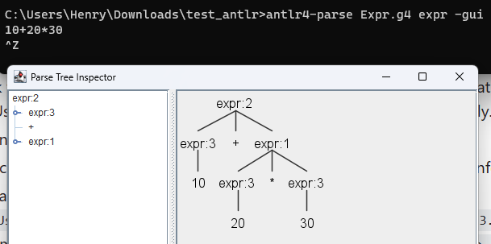
    - 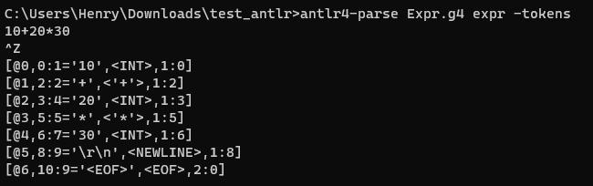
  - 小组作业要求提交的语法分析树不是这里的截图，需要以JSON或者YAML格式输出。
  - 这个语法中包含`NEWLINE : [\r\n]+ -> skip;`，也就是换行不会影响语法解析结果。所以在输入Ctrl-Z（Windows）或者Ctrl-D（Linux、macOS）之前之后都输入一个回车，否则可能显示不出结果。

## 词法规则与语法规则

### 测试平台——官网ANTLR LAB

网址：http://lab.antlr.org/

测试的时候，直接把Lexer里面的内容删掉，把语法规则放到Parser里面。设置好start rule（这里是`prog`），输入语句，点击Run即可。

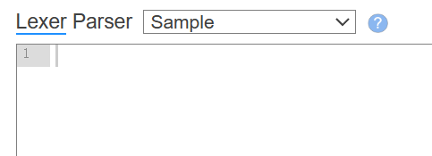

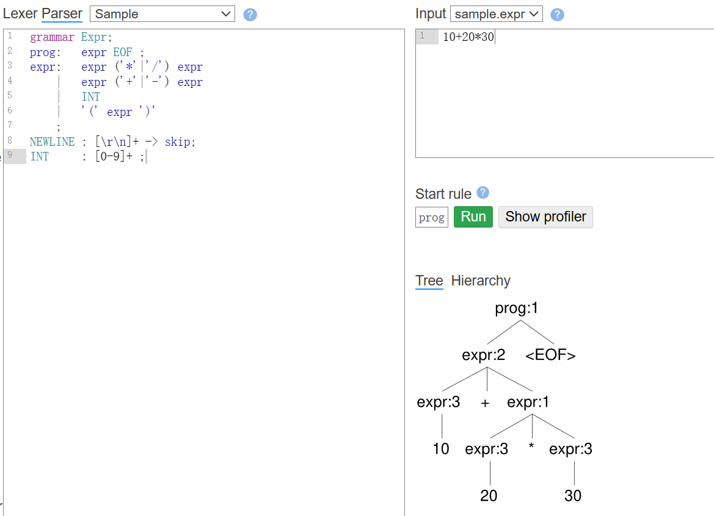

### 词法规则设计

官方说明：[antlr4/doc/lexer-rules.md](https://github.com/antlr/antlr4/blob/d25d421780286e3de0714831a5f82eca59234249/doc/lexer-rules.md)

ANTLR的词法分析器（Lexer）规则是用于定义如何将输入文本分割成一系列的词法单元（Tokens）的规则。这些规则在ANTLR中扮演着重要的角色，是构建有效解析器的关键部分。

#### 常用内容（以官方说明为准）

1. **标准词法规则**：定义了生成词法单元的模式。规则名称【必须以大写字母开头】。
   
   ```antlr
   TokenName : alternative1 | ... | alternativeN ;
   ```
   
2. **fragment规则**：用于辅助标准词法规则识别词法单元，但本身不生成词法单元（不能用于语法规则里面）。这些规则用`fragment`关键字标记。
   
   ```antlr
   fragment HelperTokenRule : alternative1 | ... | alternativeN ;
   ```
   
   例如：`fragment DIGIT : [0-9] ;`，这个例子中，`DIGIT`是一个辅助词法单元，用于表示单个数字。它可以在定义其他词法单元时被引用：`INT : DIGIT+ ;`。但不能直接放在expr中，一个**错误的**例子是：
   
   ```
   grammar Expr;		
   prog:	expr EOF ;
   expr:	expr ('*'|'/') expr
       |	expr ('+'|'-') expr
       |	DIGIT+ 
       |	'(' expr ')'
       ;
   NEWLINE : [\r\n]+ -> skip;
   INT : DIGIT+ ;
   fragment DIGIT : [0-9] ;
   ```
   
   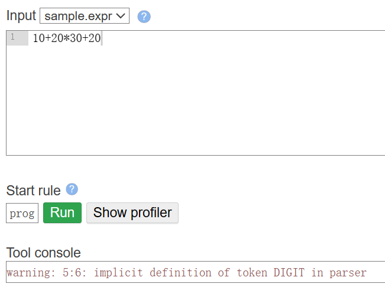
   
3. **词法规则元素**：包括字符范围操作符（..），字符集（[characters]），字符串字面值，词法规则引用等。可以用在语法规则里面，也可以放在词法规则里面。
   
   - 字符集里面直接写内容即可，可以用转义字符，可以输入空格（比如想用空格隔开不同的token的时候，可以写`SPACE: [ ]+ -> skip;`），`-`代表范围。
   
   ```antlr
   'literal'
   [char set]
   'x'..'y'
   ```

   例如：

   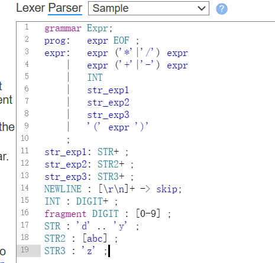

   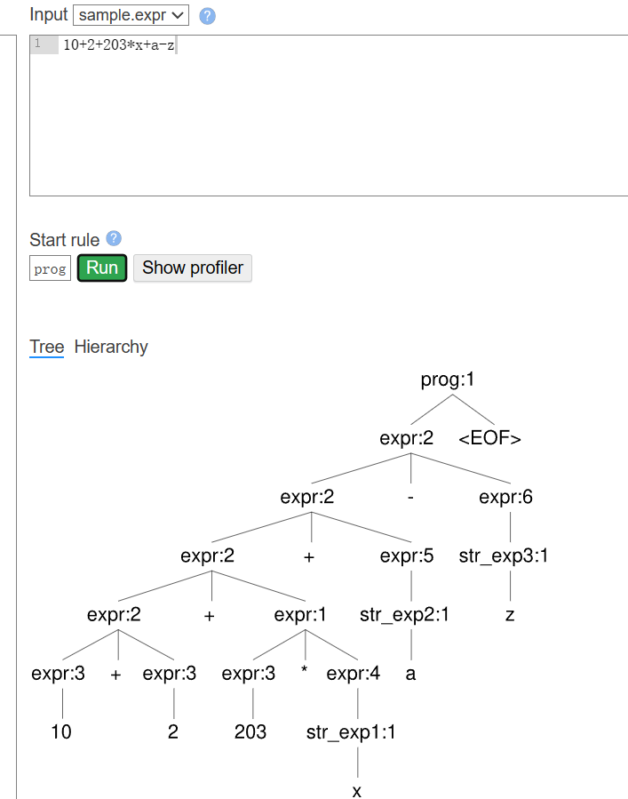

5. **词法命令**：提供了一种避免语法与特定目标语言绑定的方式，通过一些常用命令（如`skip`）来控制词法分析的行为。

   ```antlr
   TokenName : «alternative» -> command-name
   ```

   - `skip`：告诉词法分析器忽略当前匹配的文本，不生成任何词法单元；
   - `more`命令：指示词法分析器将当前文本追加到下一个匹配的词法单元中；
   - `pushMode(x)`：将词法分析器切换到指定的模式`x`，同时将当前模式压入模式栈、`popMode`：从模式栈中弹出顶部模式，并将词法分析器切换到弹出的模式、`mode(x)`：直接将词法分析器切换到指定的模式`x`；
   - `type(x)`：在匹配规则时动态改变词法单元的类型；
   - `channel(x)`命令用于将词法单元发送到指定的通道，ANTLR支持多个通道，通常用于分离诸如注释之类的内容，这些内容虽然需要词法分析，但不参与后续的语法解析。

   具体参见[Lexer Commands](https://github.com/antlr/antlr4/blob/d25d421780286e3de0714831a5f82eca59234249/doc/lexer-rules.md#lexer-commands) 

#### 注意事项

1. **区分大小写**：词法规则名称必须以大写字母开头（包括fragment）。
2. **避免歧义，注意顺序**：尽量让不同的词法规则不要产生歧义或重叠。如果会有重叠，注意顺序。
   - 比如这样可以解析`10 + 2 and x`：
     - 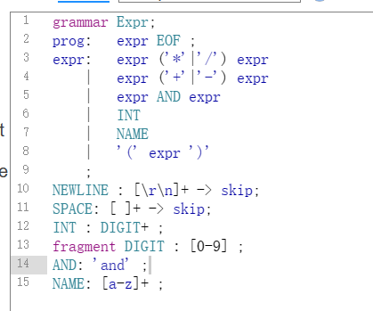
   - 这样不行（`and`被匹配到了`NAME`而非`AND`）：
     - 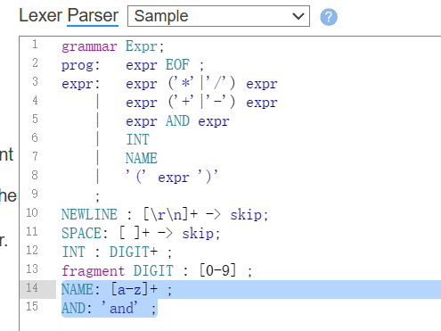
     - 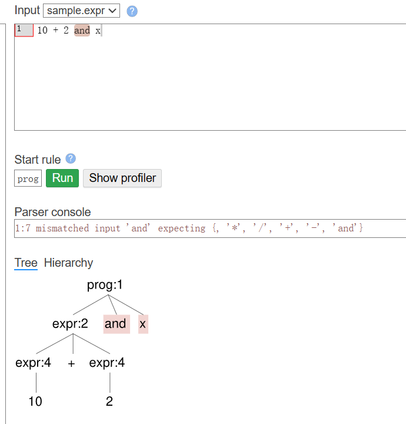
3. **字符集和范围**：在定义字符集和范围时，确保它们正确地表示所需的字符序列。

其他特性，如 [Lexer Rule Actions](https://github.com/antlr/antlr4/blob/d25d421780286e3de0714831a5f82eca59234249/doc/lexer-rules.md#lexer-rule-actions)（嵌入在词法规则中的代码片段，这些动作在匹配到对应的词法规则时被执行）、[Recursive Lexer Rules](https://github.com/antlr/antlr4/blob/d25d421780286e3de0714831a5f82eca59234249/doc/lexer-rules.md#recursive-lexer-rules)（ANTLR支持递归的词法规则，这对于匹配嵌套结构非常有用）参见官方文档中的对应说明。

### 语法规则设计

官方说明：[antlr4/doc/parser-rules.md](https://github.com/antlr/antlr4/blob/d25d421780286e3de0714831a5f82eca59234249/doc/parser-rules.md)

ANTLR的语法规则（Parser Rules）构成了解析器的核心，用于定义如何将词法单元组合成特定的语法结构。类似于课上说的文法的格式：

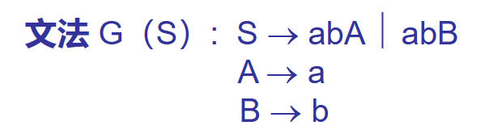

语法规则名称以小写字母开头。

#### 常用内容（以官方说明为准）

- 语法规则基本形式：
  - 语法规则由规则名称和一系列alternatives组成。
  - 每个规则可以包含一个或多个alternative，由`|`符号分隔。
  - alternative可以是规则元素的列表或为空，空的alternative使得整个规则变为可选。

- 语法规则名称以小写字母开头。
- 开始规则和EOF
  - 任何规则都可以作为开始规则，即解析器首先调用的规则。
  - 开始规则不一定要消耗所有输入，除非明确指定了EOF（文件结束符）。
- 规则中可以写类似于正则中的问号、星号和加号：

  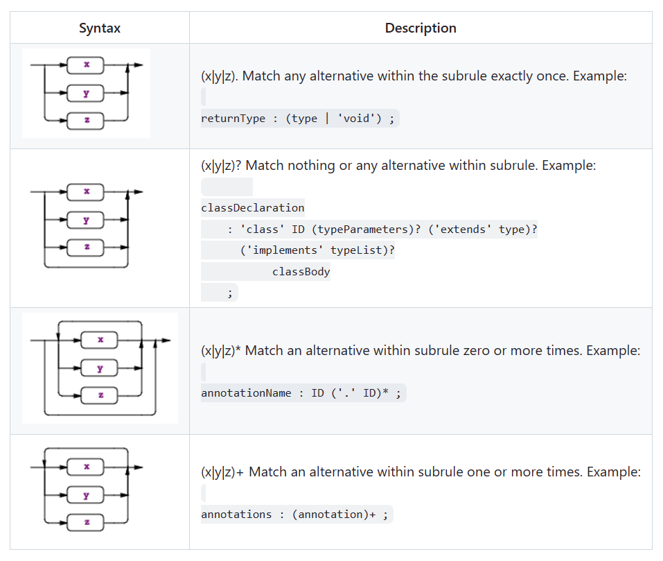

例如：

```
expr:	expr ('*'|'/') expr
    |	expr ('+'|'-') expr
    |	DIGIT+ 
    |	'(' expr ')'
    ;
```

#### Alternative Labels（为后续处理准备标签）

- 通过使用`#`为规则的alternative添加标签。后续处理的时候可以对应到每个label的函数中。
- 一个语法规则对应的所有alternative必须都加上label标记或者都不加。

例如：

```
grammar T;
stat: 'return' e ';' # Return
 	| 'break' ';' # Break
 	;
e   : e '*' e # Mult
    | e '+' e # Add
    | INT # Int
    ;
```

``` java
public interface AListener extends ParseTreeListener {
 	void enterReturn(AParser.ReturnContext ctx);
 	void exitReturn(AParser.ReturnContext ctx);
 	void enterBreak(AParser.BreakContext ctx);
 	void exitBreak(AParser.BreakContext ctx);
 	void enterMult(AParser.MultContext ctx);
 	void exitMult(AParser.MultContext ctx);
 	void enterAdd(AParser.AddContext ctx);
 	void exitAdd(AParser.AddContext ctx);
 	void enterInt(AParser.IntContext ctx);
 	void exitInt(AParser.IntContext ctx);
}
```

#### Rule Element Labels（为后续处理准备标签）

例如：

```
stat: 'return' e ';' # Return
 	| 'break' ';' # Break
 	;
```

改成：

```
stat: 'return' value=e ';' # Return
 	| 'break' ';' # Break
 	;
```

加一个`value=`，后面方便使用（直接用`value`指代即可）。

#### 注意事项

1. **注意顺序 与 运算符优先级**：在数学运算中，不同运算符有不同的优先级。例如，乘法和除法通常比加法和减法有更高的优先级。在ANTLR中，可以通过在语法文件中安排规则的顺序来实现这一点。规则越是在文件中靠上的位置，它的优先级就越高。例如：

   - 在之前的例子中：

      ```
      grammar Expr;		
      prog:	expr EOF ;
      expr:	expr ('*'|'/') expr
          |	expr ('+'|'-') expr
          |	INT
          |	'(' expr ')'
          ;
      NEWLINE : [\r\n]+ -> skip;
      INT     : [0-9]+ ;
      ```

      `1+2*3+4`中，`2*3`是先进行计算的。
      
      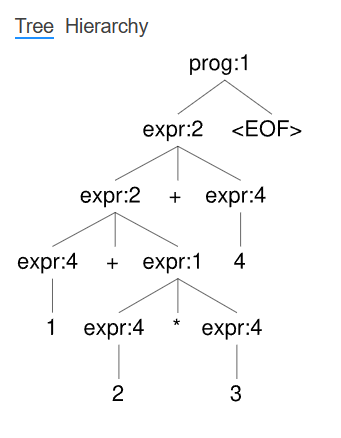

2. **左递归和右递归**：虽然LL(*)不能有左递归，但在ANTLR中有额外处理，写左递归或者右递归也没问题。

   - 例如：

     - ```
       grammar Expr;	
       s  : s 'a'
          | 'b' ;	
       ```

更多内容参见官方说明：[antlr4/doc/parser-rules.md](https://github.com/antlr/antlr4/blob/d25d421780286e3de0714831a5f82eca59234249/doc/parser-rules.md)

## 示例：利用Listener和Visitor进行数学公式计算以及转换为逆波兰表达式（以Dlanguage=Python3为例）

Listener和Visitor都是ANTLR生成的用于遍历语法树的工具，它们的作用是在遍历语法树时执行自定义的操作，在用法和实现方式上有一些区别。

**1. Listener：**

- **用法**：Listener基于回调机制，你需要创建一个Listener类，然后覆盖你关心的语法规则进入和退出时调用的方法。ANTLR会自动生成Listener接口，并为每个语法规则生成一个进入方法（`enter<RuleName>`）和一个退出方法（`exit<RuleName>`）。

- **遍历方式**：ANTLR会自动按照语法树的结构来调用Listener的方法，从根节点开始，依次进入和退出每个语法规则。这是一种深度优先遍历方式。

- **示例用途**：Listeners适用于需要对语法树执行相对简单操作的情况，比如计算表达式的值、生成代码等。

**2. Visitor：**

- **用法**：Visitor也需要创建一个Visitor类，但不同于Listener，你需要为每个语法规则编写`visit<RuleName>`方法，以定义该规则被访问时应该执行的操作。

- **遍历方式**：与Listener不同，Visitor需要显式地调用访问方法。你需要手动调用`visit`方法来访问语法树的节点。这使得你能够更精确地控制遍历顺序，可以实现不同的遍历策略，例如广度优先遍历。

- **示例用途**：Visitors通常用于需要进行复杂的语法树遍历和操作的情况，比如静态分析、优化、生成中间表示等。

总结一下，Listener适用于相对简单的操作，而且它的遍历方式是固定的（深度优先遍历）。Visitor更加灵活，可以实现不同的遍历策略，但需要显式地控制遍历流程。选择Listener还是Visitor取决于你的具体需求和遍历复杂度。

### 安装python包

之前安装的是antlr，但没有安装好对应的python runtime的包。所以执行指令：

`pip install antlr4-python3-runtime`

### g4文件

```
grammar Expr;
prog:   expr NEWLINE ;
expr:   expr ('*'|'/') expr
    |   expr ('+'|'-') expr
    |   INT
    |   '(' expr ')'
    ;
NEWLINE : [\r\n]+ ;
INT     : [0-9]+ ;
```

### 使用Listener

首先在`Expr.g4`的文件夹下执行命令`antlr4 Expr.g4 -Dlanguage=Python3`

生成python文件后，自己写一个类（比如叫做`MyListener`）继承`ExprListener.py`文件中的`ExprListener`类。由于是深度优先遍历，exit的时候对应节点的孩子都已经访问过了，所以计算过程可以用栈实现，将当前节点孩子节点的信息都从栈中弹出来，算出当前节点的结果，再压入栈中。

#### 公式计算

``` python
from antlr4 import *
from ExprLexer import ExprLexer
from ExprParser import ExprParser
from ExprListener import ExprListener


class MyListener(ExprListener):
    def __init__(self):
        self.stack = []

    def exitExpr(self, ctx):
        """
        This method is called when exiting the 'expr' rule in the grammar.
        It performs the necessary operations based on the parsed expression.

        Parameters:
            ctx (antlr4.tree.ParseTree): The parse tree node for the 'expr' rule.

        Returns:
            None
        """
        if ctx.INT():
            self.stack.append(int(ctx.INT().getText()))
        elif ctx.getChildCount() == 3:
            if ctx.getChild(0).getText() == '(':
                pass
            else:
                left = self.stack.pop()
                right = self.stack.pop()
                op = ctx.getChild(1).getText()
                if op == '+':
                    self.stack.append(left + right)
                elif op == '-':
                    self.stack.append(left - right)
                elif op == '*':
                    self.stack.append(left * right)
                elif op == '/':
                    self.stack.append(left / right)

    def getResult(self):
        return self.stack[-1]

# 创建词法和语法分析器
input_stream = InputStream("(5+2)*3\n")
lexer = ExprLexer(input_stream)
stream = CommonTokenStream(lexer)
parser = ExprParser(stream)

# 创建自定义Listener
listener = MyListener()

# 添加Listener到解析器
parser.addParseListener(listener)

# 开始解析
tree = parser.prog()

# 获取计算结果
result = listener.getResult()
print("Result:", result)
```

#### 逆波兰表达式

```python
from antlr4 import *
from ExprLexer import ExprLexer
from ExprParser import ExprParser
from ExprListener import ExprListener


class MyListener(ExprListener):
    def __init__(self):
        self.stack = []
        self.output = []

    def exitExpr(self, ctx):
        """
        This method is called when exiting the 'expr' rule in the grammar.
        It performs the necessary operations based on the parsed expression.

        Parameters:
            ctx (antlr4.tree.ParseTree): The parse tree node for the 'expr' rule.

        Returns:
            None
        """
        if ctx.INT():
            self.output.append(ctx.INT().getText())
        elif ctx.getChildCount() == 3:
            if ctx.getChild(0).getText() == '(':
                pass
            else:
                # 这里的顺序是反的
                right = self.output.pop()
                left = self.output.pop()
                op = ctx.getChild(1).getText()
                self.output.append(left + " " + right + " " + op)

    def getReversePolishNotation(self):
        return self.output[-1]

# 创建词法和语法分析器
input_stream = InputStream("(5+2)*3\n")
lexer = ExprLexer(input_stream)
stream = CommonTokenStream(lexer)
parser = ExprParser(stream)

# 创建自定义Listener
listener = MyListener()

# 添加Listener到解析器
parser.addParseListener(listener)

# 开始解析
tree = parser.prog()

# 获取逆波兰表达式
rpn = listener.getReversePolishNotation()
print("Reverse Polish Notation:", rpn)
```

### 使用Visitor

首先在`Expr.g4`的文件夹下执行命令`antlr4 Expr.g4 -Dlanguage=Python3 -visitor`（多了一个`-visitor`）。

相比之前，会多一个`ExprVisitor.py`文件。

#### 公式计算

``` python
from antlr4 import *
from ExprLexer import ExprLexer
from ExprParser import ExprParser
from ExprVisitor import ExprVisitor

class EvalVisitor(ExprVisitor):
    def visitProg(self, ctx):
        return self.visit(ctx.expr())

    def visitExpr(self, ctx):
        """
        Visits the expression context and evaluates the expression.

        Args:
            ctx: The expression context.

        Returns:
            The evaluated result of the expression.
        """
        if ctx.INT():
            return int(ctx.INT().getText())
        elif ctx.getChildCount() == 3:
            if ctx.getChild(0).getText() == '(':
                return self.visit(ctx.expr(0))
            else:
                left = self.visit(ctx.expr(0))
                right = self.visit(ctx.expr(1))
                op = ctx.getChild(1).getText()
                if op == '+':
                    return left + right
                elif op == '-':
                    return left - right
                elif op == '*':
                    return left * right
                elif op == '/':
                    return left / right

# 创建词法和语法分析器
input_stream = InputStream("(5+2)*3\n")
lexer = ExprLexer(input_stream)
stream = CommonTokenStream(lexer)
parser = ExprParser(stream)

# 创建自定义Visitor
visitor = EvalVisitor()

# 开始解析并获取计算结果
result = visitor.visit(parser.prog())
print("Result:", result)
```

#### 逆波兰表达式

``` python
from antlr4 import *
from ExprLexer import ExprLexer
from ExprParser import ExprParser
from ExprVisitor import ExprVisitor

class EvalVisitor(ExprVisitor):
    def visitProg(self, ctx):
        return self.visit(ctx.expr())

    def visitExpr(self, ctx):
        """
        Visits the expression context and evaluates the expression.

        Args:
            ctx: The expression context.

        Returns:
            The Reverse Polish Notation.
        """
        if ctx.INT():
            return ctx.INT().getText()
        elif ctx.getChildCount() == 3:
            if ctx.getChild(0).getText() == '(':
                return self.visit(ctx.expr(0))
            else:
                left = self.visit(ctx.expr(0))
                right = self.visit(ctx.expr(1))
                op = ctx.getChild(1).getText()
                return left + " " + right + " " + op

# 创建词法和语法分析器
input_stream = InputStream("(5+2)*3\n")
lexer = ExprLexer(input_stream)
stream = CommonTokenStream(lexer)
parser = ExprParser(stream)

# 创建自定义Visitor
visitor = EvalVisitor()

# 开始解析并获取计算结果
result = visitor.visit(parser.prog())
print("Reverse Polish Notation:", result)
```

### 使用Alternative Labels和Rule Element Labels

之前的代码里，通过if判断是哪个语句。

如果加上Alternative Labels和Rule Element Labels，

```
grammar Expr;
prog:   expr NEWLINE ;
expr:   e=expr ('*'|'/') r=expr   # mulDivExpr
    |   e=expr ('+'|'-') r=expr   # addSubExpr
    |   INT                      # intExpr
    |   '(' expr ')'             # parenExpr
    ;
NEWLINE : [\r\n]+ ;
INT     : [0-9]+ ;
```

就可以这样写visitor：

``` python
class MyVisitor(ExprVisitor):
    def visitProg(self, ctx):
        return self.visit(ctx.expr())
    
    def visitMulDivExpr(self, ctx):
        left = self.visit(ctx.e)
        right = self.visit(ctx.r)
        op = ctx.getChild(1).getText()
        if op == '*':
            return left * right
        elif op == '/':
            return left / right

    def visitAddSubExpr(self, ctx):
        left = self.visit(ctx.e)
        right = self.visit(ctx.r)
        op = ctx.getChild(1).getText()
        if op == '+':
            return left + right
        elif op == '-':
            return left - right

    def visitIntExpr(self, ctx):
        return int(ctx.INT().getText())

    def visitParenExpr(self, ctx):
        return self.visit(ctx.expr())
```

其中，各个Alternative Labels的函数分开了，Rule Element Labels也用上了（例如是：`left = self.visit(ctx.e)`，而不是`left = self.visit(ctx.expr(0))`）。

### 使用其他Dlanguage

直接在命令里设置即可，比如生成Javascript代码的命令为：

- `antlr4 Expr.g4 -Dlanguage=JavaScript -visitor`

具体用法见[antlr4/doc](https://github.com/antlr/antlr4/tree/d25d421780286e3de0714831a5f82eca59234249/doc)目录下的`[语言名]-target.md`中的说明。

## 小组作业提示

做法不唯一，在此提供一个用visitor实现的大致思路：

如果用visitor：

- 对于语法树上每个节点，其visit结果可以自行设计数据结构，需要什么信息存储什么信息；
- 可以写成递归函数，比如上述例子中的`visitAddSubExpr`，里面首先调用`self.visit`函数作用于每个子节点，再利用每个子节点的结果，生成当前节点的结果；
- 可以全局存储一些信息（如符号表）。

具体地，可以用visitor从根节点开始，遍历每个节点及其子节点：

1. 词法分析，生成每个节点的子节点的token内容，按顺序组合成列表；
2. 语法分析，生成每个节点的子节点的子树（dict形式），再生成当前节点的dict；
3. 编译器/翻译器选题，生成每个节点的子节点的目标代码，按规律组合成目标代码。其中可能涉及到一些预处理步骤 以及 一些函数的特殊处理；
4. 语法高亮，记录每个节点对应的类型信息，某些类型的节点对应的生成结果应当有自己的颜色（可以用html标签标识颜色）；
5. 代码提示，需要在全局保存的信息中进行检索并返回结果，注意及时存储作用域等信息。
